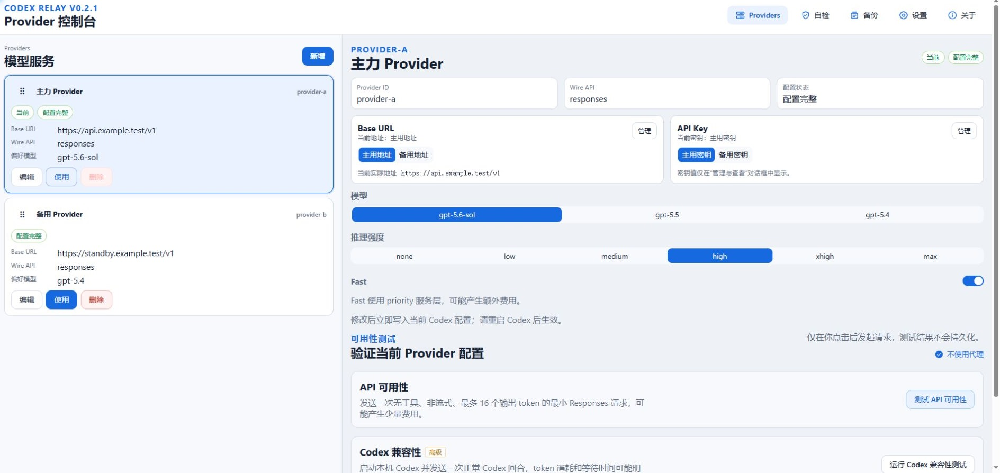
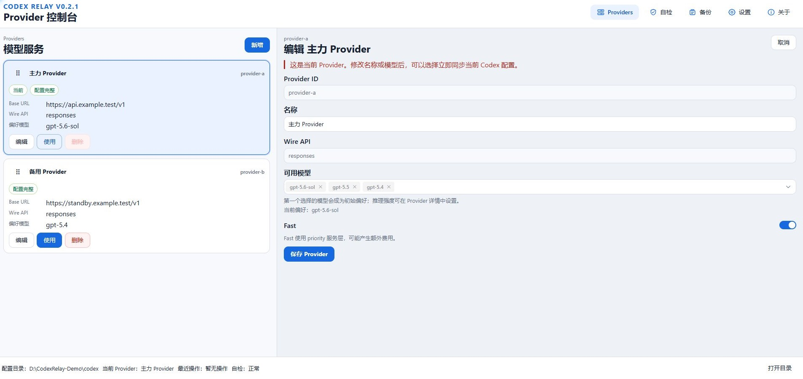
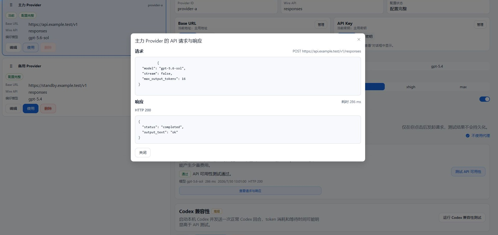
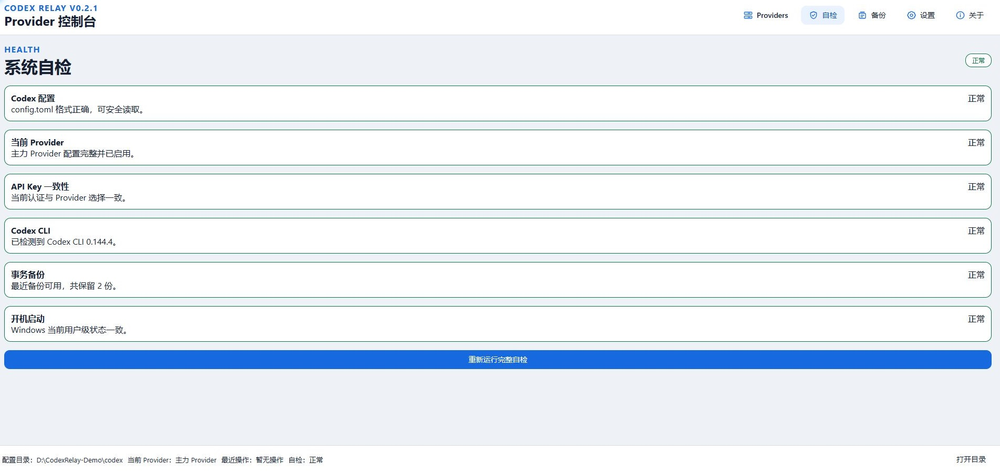

# Codex Relay

Codex Relay 是一款面向 Windows 10/11 的轻量桌面工具，用于管理当前 Windows 用户的 Codex Provider 配置、API Key、事务备份、自检、系统托盘和开机启动。应用基于 Tauri 2、Vue 3 与 Rust，主程序名为 `CodexRelay.exe`。



## 主要功能

- 读取并管理 `config.toml` 中已有的 `[model_providers.<id>]`。
- 新增、编辑、删除 Provider，保留无关 TOML 注释、未知字段和功能开关。
- 为每个 Provider 保存多个命名 Base URL 和多个命名 API Key，在详情页按名称独立切换。
- Base URL 与 API Key 分别管理；当前 Provider 的选择立即写入 Codex 配置，非当前 Provider 只保存预选。
- 可保持顶层 `model_provider` 身份，仅把另一 Provider 已选中的 Base URL 与 API Key 应用为当前连接，并可显式恢复自身连接。
- 为每个 Provider 保存独立 Fast 偏好；支持模型开启后投影到 Codex 的 Fast/priority 服务层。
- API Key 管理器打开后直接查看全部明文密钥，可统一隐藏/显示并逐项复制；关闭后清空前端密钥状态。
- 在 Provider 详情显式运行 API 可用性测试或 Codex 兼容性测试，分别验证最小 Responses 请求和一次正常 Codex 回合。
- 切换时以同一事务更新 `config.toml` 与 `auth.json`，失败时验证回滚结果。
- 关键自检与后台扩展自检，包括配置、密钥一致性、Codex CLI、开机启动、备份和外部修改。
- 系统托盘切换、单实例、Windows 通知、窗口位置恢复和关闭到托盘。
- 当前用户级开机启动，无需 Windows 服务或管理员权限。
- 设置页手动检查 GitHub Releases 更新，并使用 Tauri 签名校验后启动 NSIS 升级。
- 修改前自动备份，最多保留最近 20 份事务备份，并支持手动恢复。
- 简体中文界面、跟随系统的明暗主题、键盘焦点态和窄窗口响应式布局。

## 界面预览

### Provider 配置与 Fast



### API 可用性测试



### 系统自检



界面截图均使用脱敏演示数据，示例地址采用保留的 `.test` 域名。

## 技术栈

- Tauri 2、Rust 2024、Tokio
- Vue 3.5、Composition API、`<script setup lang="ts">`
- TypeScript、Vite、Vitest、Vue Test Utils
- `toml_edit`、`serde`、`serde_json`
- Tauri Single Instance、Autostart、Notification、Updater 与 Tray API
- NSIS Windows 安装包

## 目录结构

```text
src/                         Vue 界面、类型、composables 与 Tauri 命令边界
src-tauri/src/               Tauri 入口、命令、托盘与桌面生命周期适配
src-tauri/crates/codex-relay-core/src/
                             Provider、模型、事务、路径与网络核心逻辑
src-tauri/crates/codex-relay-core/tests/
                             临时目录集成测试与真实路径安全门禁
src-tauri/icons/             Tauri/Windows 图标
src-tauri/installer/         自定义 NSIS 安装模板
fixtures/                    仅含假密钥的测试样例
scripts/prepare-dev-data.ps1 安全开发数据与环境覆盖脚本
dev-data/                    被 Git 忽略的本地开发配置
.trellis/                    任务生命周期、上下文检查点与分层项目规范
.agents/skills/              Trellis 提供的项目工作流技能
.codex/                      仓库级 Codex hooks 与 inline agent 配置
AGENTS.md                    每轮必须加载的最高优先级规则
```

## 环境要求

1. Windows 10 或 Windows 11。
2. Node.js 20.19+ 或 22.12+ 与 npm。
3. Rust stable 与 Cargo。
4. Microsoft C++ Build Tools（Desktop development with C++）。
5. Microsoft Edge WebView2 Runtime。Windows 10/11 通常已安装。
6. 构建 NSIS 安装包时需要 Tauri CLI 能下载或找到所需打包工具。
7. 进行非平凡项目开发时使用 Trellis CLI 0.6.7；应用使用和普通构建不依赖 Trellis。

## 安装与首次使用

Release 构建完成后，运行 `src-tauri/target/release/bundle/nsis/` 下实际生成的 `.exe` 安装器。安装模式是所有用户（per-machine），需要管理员权限。首次安装时，如果 `D:` 是固定磁盘，默认目录为 `D:\Program Files\Codex Relay`；否则使用与构建目标架构匹配的系统 Program Files 目录，当前交付的 x64 安装包通常回退到 `C:\Program Files\Codex Relay`。新鲜安装可以选择目录；已登记的 per-machine 版本升级（包括手动运行安装器和应用内更新）固定沿用上次目录，不允许在升级流程中并存安装。若要更换位置，请先从 Windows“已安装的应用”卸载旧版，再重新运行安装器；卸载不会删除 Codex 配置和应用数据。开始菜单项位于“Codex Relay”目录。若电脑上安装过旧的 current-user 版本，也请先卸载旧版，避免 AppData 与 Program Files 中同时保留两套程序。

首次启动且 `config.toml` 不存在或没有 Provider 时，会出现引导页。可打开配置目录、新增第一个 Provider、稍后设置或退出。应用不会自动创建带虚假地址的 Provider。

Provider 可用性测试不会在启动、自检、列表刷新或文件监控时自动运行；只有用户在 Provider 详情点击测试按钮后，应用才会访问目标模型网络。测试不修改当前 `config.toml`、`auth.json`、Provider 选择或模型偏好。

## 开发

安装依赖：

```powershell
npm install
```

只启动前端：

```powershell
npm run dev:frontend
```

推荐使用安全开发模式启动完整 Tauri 应用：

```powershell
npm run dev:safe
```

`dev:safe` 会在仓库的 `dev-data` 下写入明确的假配置和假密钥 `test-key-provider-a-not-real`、`test-key-b-not-real`，设置 `CODEX_RELAY_CODEX_HOME`、`CODEX_RELAY_APP_DATA_DIR` 后再启动 Tauri。用户始终通过 `npm run dev:safe` 进入；脚本内部使用 `npm.cmd run dev`，避免 Windows PowerShell 把 `& npm run dev` 错误解析为 `pm`。安全模式不会读取或修改真实 `%USERPROFILE%\.codex` 或 `%LOCALAPPDATA%\CodexRelay`。

进行 Rust TDD、同时又需要保持窗口与前端开发服务器运行时，使用安全无 watcher 模式：

```powershell
npm run dev:safe:no-watch
```

该入口复用相同的假数据和成对路径覆盖，但通过 `tauri dev --no-watch` 禁止 Rust 源码自动重编译，
避免每次修改同时触发 Tauri dev 与手动 Cargo 两套构建。Rust 行为变化不会自动进入正在运行的
应用；需要人工观察最新后端行为时，请主动重启该安全开发进程。纯前端修改优先使用
`npm run dev:frontend`。

不要在没有路径覆盖的情况下直接运行 `npm run dev`，因为普通开发入口不会自动隔离真实 Codex 配置。只有当前终端已经同时设置两个 Relay 覆盖变量时，才可以手动启动：

```powershell
$env:CODEX_RELAY_CODEX_HOME = "$PWD\dev-data\codex"
$env:CODEX_RELAY_APP_DATA_DIR = "$PWD\dev-data\app-data"
npm run dev
```

仅准备安全数据、不启动应用：

```powershell
powershell -ExecutionPolicy Bypass -File scripts/prepare-dev-data.ps1 -PrepareOnly
```

`-PrepareOnly` 只创建或刷新安全数据，不启动应用。该命令会启动子 PowerShell，因此脚本内设置的环境变量不会回传到当前终端；若随后需要手动运行 `npm run dev`，必须按上面的示例在当前终端重新设置两个 Relay 覆盖变量。

## Trellis 开发工作流

非平凡开发由仓库内的 Trellis `tdd` 工作流管理，Codex 使用 inline 模式，不启用 channel 或 sub-agent dispatch。任务的 PRD、设计、实施计划、进度和验证证据位于 `.trellis/tasks/`，长期项目规则位于 `.trellis/spec/`。

恢复当前任务时先运行：

```powershell
python .trellis/scripts/task.py current --source
```

随后读取当前任务的 `task.json`、`prd.md`、`design.md` 和 `implement.md`，再按任务只加载相关规范。若检查点仍缺少某段历史细节，可使用：

```powershell
trellis mem search "<关键词>"
trellis mem context <session-id>
```

`trellis mem` 只用于补救，不能替代持续更新 `implement.md`。完整生命周期、上下文恢复和文档归档规则见 `.trellis/spec/workflow/`。

## 测试与检查

Rust Provider 行为切片优先使用固定 `src-tauri/target` 的快速入口：

```powershell
npm run test:rust:lib -- provider_http
npm run test:rust:path-safety
npm run test:rust:provider-workflow
```

这些命令会在 Cargo 启动前检查是否存在未带 `--no-watch` 的 Tauri dev；发现冲突时停止并提示改用
安全无 watcher 或纯前端入口。三个入口都显式选择 `codex-relay-core`，因此 Provider、事务和路径
专项不会编译或链接 Tauri 应用 crate。不要为每个任务创建随机 `CARGO_TARGET_DIR`，也不要把删除
`src-tauri/target` 当作日常提速手段。

快速入口只缩短红—绿循环，不能替代完整门禁：

```powershell
npm run typecheck
npm run test
npm run check:rust:deps
npm run check:frontend
npm run check:rust
npm run check
```

`check:rust:deps` 断言 Rustls 使用显式 `ring` provider、依赖图没有重复的 `aws-lc-sys`，并且
`codex-relay-core` 的真实依赖树不包含 Tauri；`check:rust` 以 workspace 范围运行 fmt、Clippy、
core 与 Tauri 应用的全部 Rust 单元和集成测试。

Rust 单元与集成测试使用 `tempfile`，并通过 `AppPaths::for_test` 或测试模式双覆盖构造路径。`path_safety` 会在安全临时目录中建立默认路径哨兵，证明 Provider/备份工作流不触及默认用户目录。

禁止让测试回退到真实用户路径。禁止把真实 API Key 写入 fixture、日志、快照或 Git。

## Codex Relay 发布控制台

仓库内包含独立的维护者工具“Codex Relay 发布控制台”。它是便携 Windows EXE，不进入正式
Codex Relay 主程序或 NSIS 安装包，也不会读取 updater 私钥。发布构建和 Tauri updater 签名仍只在
GitHub Actions 中完成。

发布电脑需预先安装 Git、Node/npm、Rust/Cargo、GitHub CLI，并完成 `gh auth login`。构建控制台：

```powershell
npm run build:release-console
```

命令会构建 `CodexRelayReleaseConsole.exe`，再复制到被 Git 忽略的
`artifacts/release-console/CodexRelayReleaseConsole.exe`，并输出实际路径、大小、时间和 SHA-256。

日常发布时直接运行该 EXE：

1. 选择 Codex Relay 仓库并执行预检。
2. 输入严格更高的目标 SemVer，检查或编辑简体中文发布说明与六个计划文件。
3. 点击“开始发布”；控制台依次完成候选事务、本地门禁、精确提交推送、GitHub Run 和 Draft 审计。
4. Draft 审计全部通过后，核对版本、候选 SHA 与 Release ID，再在确认对话框中正式公开。
5. 等待 Latest、tag、manifest、公开资产和历史清理复核，必要时导出不含秘密的结果摘要。

控制台重启后可选择同一仓库并加载活动会话；push 失败且本地提交已创建时会保留 `Committed`
检查点，只重试推送，不重复创建发布提交。首版不执行 Windows Sandbox、真实安装、UAC、应用内升级、
重启、卸载或数据保留验证，也不会把这些未执行行为显示为成功。完整操作和失败边界见
[Windows 更新发布操作指南](.trellis/spec/release/publishing.md)。

## Debug、Release 与 NSIS 构建

Debug 构建只生成主程序，不创建安装包：

```powershell
npm run build:debug
```

普通 Release 构建会按照当前 `targets: ["nsis"]` 同时生成 Release 主程序和 NSIS 安装器，不需要 Tauri 更新私钥：

```powershell
npm run build
```

发布专用构建会额外生成 updater artifacts，必须在安全环境提供 Tauri 更新私钥：

```powershell
npm run build:release
```

不要把 `TAURI_SIGNING_PRIVATE_KEY` 或密码写入仓库、命令历史、日志或任务材料。普通开发和本地 NSIS 构建应使用 `npm run build`。

也可以使用以下替代入口显式请求普通 NSIS bundle：

```powershell
npm run bundle:nsis
```

- Debug 可执行文件位于 `src-tauri/target/debug/`。
- Release 主程序通常位于 `src-tauri/target/release/CodexRelay.exe`。
- NSIS 安装器位于 `src-tauri/target/release/bundle/nsis/`。
- 最终报告必须枚举实际产物路径，不能只根据约定猜测文件名。

## 路径解析

Codex 配置目录按以下优先级解析：

1. `CODEX_RELAY_CODEX_HOME`：仅用于开发和测试的强制覆盖。
2. `CODEX_HOME`：用户现有 Codex 配置覆盖。
3. `%USERPROFILE%\.codex`：正式应用默认值。

应用数据目录按以下优先级解析：

1. `CODEX_RELAY_APP_DATA_DIR`：仅用于开发和测试。
2. `%LOCALAPPDATA%\CodexRelay`：正式应用默认值。

测试模式缺少任一 Relay 覆盖变量时会返回 `TEST_PATH_OVERRIDE_REQUIRED`，不会回退到真实目录。指向真实 `.codex` 或 CodexRelay 数据目录会返回 `UNSAFE_TEST_PATH`。

## 数据文件职责

### `config.toml`

Codex Provider 配置的主要数据源。每个 Provider 的实际 `base_url` 是当前 Base URL 选择或连接覆盖的唯一真相。Codex Relay 只局部修改目标 Provider、顶层 `model_provider`、`model`、`model_reasoning_effort`、`cli_auth_credentials_store` 和 Fast 投影。“仅应用连接”只更新顶层当前身份对应 Provider 块的 `base_url`，不改变顶层 `model_provider`、模型、推理强度或 Fast。Provider 块内不写入 Relay 私有列表或模型偏好；其他 Provider、注释、非 Fast feature 和未知字段必须保留。

### `auth.json`

保存当前生效认证：

```json
{
  "OPENAI_API_KEY": "当前 Provider 的 API Key"
}
```

当前 Provider 切换命名密钥、切换 Provider、应用连接或恢复连接成功后写入目标密钥。普通 Provider 列表、通知和日志都不会返回该明文。

### `providers.json`

位于 `%LOCALAPPDATA%\CodexRelay\providers.json`。版本 2 按 Provider ID 保存有序的多个命名 API Key、稳定条目 ID 和 `selectedApiKeyId`；非当前 Provider 的密钥预选只保存在这里，不会写入当前 `auth.json`。文件损坏时不会静默覆盖；应用先保存损坏副本，再返回安全错误。版本 1 的单密钥格式只读兼容，在下一次成功用户事务后升级。

### `provider-preferences.json`

位于 `%LOCALAPPDATA%\CodexRelay\provider-preferences.json`。版本 4 保存 Provider 列表显示顺序，以及每个 Provider 有序的多个命名 Base URL、稳定条目 ID、可用模型、当前偏好模型、逐模型 `model_reasoning_effort` 和布尔 `fastEnabled`；可选的 `connectionOverride` 只记录目标、来源、已应用和恢复条目的稳定 ID，不复制 URL 或 API Key。列表顺序和 Fast 都是 Relay 私有偏好，不会写入 `[model_providers.<id>]`；未记录或外部新增的 Provider 按 `config.toml` 顺序追加。该文件不保存第二份 URL 选择游标；没有连接覆盖时，当前选择由 `config.toml.base_url` 与命名列表匹配得到。模型目录随软件版本发布，不支持在线更新。版本 1/2/3 只读兼容，并仅在下一次成功用户事务后写出 v4；旧版 Relay 可能拒绝 v4，降级前应先恢复活动连接并保留当前备份。

### Provider Fast 偏好

Fast 默认关闭。当前内置目录支持 `gpt-5.6-sol`、`gpt-5.6-terra`、`gpt-5.6-luna`、`gpt-5.5` 和 `gpt-5.4`；`gpt-5.4-mini` 不支持。模型不支持时开关保持关闭并显示原因；已开启 Fast 后把模型集合改到不支持的偏好模型，会在同一 Provider 事务中自动关闭 Fast。Relay 不提供通用 `service_tier` 下拉框，也不会在运行时调用 `codex debug models` 或通过真实网络探测能力。

应用 Fast Provider 时，Relay 在 `config.toml` 顶层写入 `service_tier = "fast"`，并单向确保 `[features].fast_mode = true`。关闭 Fast 只删除顶层 `service_tier`，不会删除 `fast_mode` 或写入 `fast_mode = false`。修改当前 Provider 的 Fast 会立即同步当前 Codex 配置；修改非当前 Provider 只保存偏好，等该 Provider 被应用时再投影。Fast 映射到 priority 服务层，可能使用更多 credits 或产生更高 API 费用。官方依据见 [Codex Configuration Reference](https://developers.openai.com/codex/config-reference/#configtoml) 与 [Speed 文档](https://learn.chatgpt.com/docs/agent-configuration/speed)。

### 其他应用数据

- `settings.json`：窗口、托盘、首次引导和开机启动配置。
- `backups/`：事务快照与不含密钥的 `metadata.json`。
- `logs/`：经过脱敏的滚动日志。

## API Key 保存方式与风险

这是面向个人本机使用的简化设计。API Key 以明文存在于 `providers.json`、当前 `auth.json`，并可能出现在事务备份的文件快照中。项目明确不使用 Windows Credential Manager、Keyring、DPAPI、Stronghold 或其他加密密钥库。

普通 Provider DTO 只包含密钥条目 ID、名称与状态。只有用户明确打开“管理与查看 API Key”对话框时，专用命令才会把目标 Provider 的完整密钥集合加载到短生命周期前端状态；对话框默认明文显示，关闭后清空。复制反馈、日志、通知和错误不会包含密钥值。

风险与建议：

- 能读取当前 Windows 用户文件的进程，可能读取这些密钥。
- 不要共享 `%LOCALAPPDATA%\CodexRelay`、`.codex`、备份目录或完整用户配置包。
- 不要把 `providers.json`、`auth.json`、备份或日志上传到公共仓库和工单。
- 不要在多人共用或不可信的 Windows 账户上保存高权限密钥。
- 怀疑泄漏时，应在 Provider 平台吊销并重新生成密钥。

详见 [路径与密钥安全](.trellis/spec/security/path-and-secret-safety.md) 和 [数据保留](.trellis/spec/security/data-retention.md)。

## Provider 操作与切换事务

新增 Provider 时录入一个初始地址名称、HTTP(S) Base URL、一个初始密钥名称、API Key 和默认关闭的 Fast 偏好；地址与密钥都成为当前选择。常规编辑只修改名称、固定 `responses` Wire API、模型集合和 Fast，不再替换或清空地址/密钥。Provider ID 创建后不可修改。

地址和密钥各自通过管理对话框批量新增、重命名、替换和删除，并在一次事务中统一保存。名称去除首尾空白后必填、同类大小写不敏感唯一，实际值也必须唯一；条目保持添加顺序且没有数量上限。当前选中项必须先切换才能删除，最后一项不能删除。

左侧 Provider 列表可通过拖动手柄排序，也可聚焦手柄后使用上下方向键调整。排序放开后立即显示，并通过只修改 `provider-preferences.json` 的受保护事务跨刷新和重启保留；它不会切换当前 Provider，也不会改写 `config.toml`、`auth.json` 或 `providers.json`。

点击 Base URL 只切换地址，点击 API Key 只切换密钥。详情页修改当前 Provider 的地址、密钥、模型偏好或 Fast 会立即同步对应全局文件并提示重启 Codex；详情页修改非当前 Provider 只保存预选。编辑当前 Provider 时继续由“保存后立即同步当前 Codex 配置”选项决定是否投影。应用非当前 Provider 时，其预选地址、密钥、模型、推理强度和 Fast 一起生效。外部未命名地址或密钥只展示状态，显式命名纳管前不能应用或测试。

左侧 Provider 卡片的“仅应用连接”保持 `model_provider` 不变，只使用来源 Provider 已选中的 Base URL 与 API Key，写入当前身份对应的 `[model_providers.<id>].base_url` 和当前 `auth.json`。需要更换组合时，先在来源详情页调整选择，再点击“更新连接”；当前身份与来源 Provider 的地址和密钥都必须先纳管。

第一次应用连接会固定当前身份覆盖前的地址与密钥条目作为恢复点。覆盖期间，当前身份的 Base URL/API Key 控件保持锁定；“恢复自身连接”会恢复到首次覆盖前的条目并清除关系。普通切换到另一个 Provider 时，同一事务会先复原旧目标 Provider 块，再应用新 Provider 和认证，不会把上一连接留在旧身份下。

切换步骤包括：重新读取四个受管文件、验证目标偏好与密钥、检查外部修改指纹、创建统一备份、生成内存结果、写入临时文件、解析验证、替换正式文件、再次验证、刷新托盘与界面。成功提示包含“请重启 Codex 后生效”。

当前 Provider 不能直接删除，必须先切换到其他 Provider。完整数据流与错误矩阵见
[Provider 多命名地址与密钥契约](.trellis/spec/project/provider-multi-credentials.md)，事务细则见
[配置事务安全](.trellis/spec/security/transaction-safety.md)。

## 自检

关键自检只执行本地路径、目录、文件、设置、Provider 和当前 Provider 检查，不调用模型接口。托盘创建后运行扩展自检，包括 TOML/JSON、Provider 有效性、密钥一致性、`codex --version`、开机启动实际状态、事务残留、备份数量和外部修改。

Codex CLI 缺失或超时属于警告，不阻止 Provider 管理；配置损坏、密钥不一致等会显示错误。

## Provider 可用性与 Codex 兼容性测试

Provider 详情提供两种彼此独立的显式测试，结果只保存在本次前端会话内；Provider 文件指纹发生变化后，旧结果会失效，不写入 Provider DTO、应用数据、日志或通知。

- **API 可用性测试**：通过 Relay 网络边界向当前 Provider 发送一次无工具、非流式、最多 16 个输出 token 的最小 Responses 请求，确认 Base URL、Bearer 认证、当前偏好模型和 Responses 完成格式。它通常只产生少量 token 费用，不代表 Codex CLI 一定兼容。
- **Codex 兼容性测试**：高级入口会先要求确认，然后在独立临时状态中启动受安全门禁的本机 Codex，向 Provider 发送一次正常 Codex 回合。它可能消耗更多 token、等待更久；不会修改当前 `config.toml` 或 `auth.json`。不支持的 Codex 版本、managed requirements 或工具能力漂移会在联系真实 Provider 前停止。
- 两种测试都要求目标 Provider 的命名地址、命名密钥和模型偏好配置完整；测试使用各自当前选择，但成功、失败或取消都不会改变选择。测试期间只允许一个 Provider 测试，界面可取消正在运行的测试。
- 点击 API 测试后“请求与响应”弹窗立即打开；请求和响应区域在测试过程中分别显示 loading，trace 返回后原位更新为实际 `POST` 地址、请求 JSON、HTTP 状态和最多 256 KiB 的响应正文，超限时明确标记截断。弹窗支持 Escape、点击遮罩和关闭按钮，关闭后可从结果卡片再次打开；未形成 trace 或取消时不会伪造请求/响应。详情不显示 Header、API Key 或代理地址，若响应意外回显当前密钥会在 Rust 边界移除。Codex 兼容性结果仍只显示安全摘要；两类结果都不会记录命令行或临时路径。

## 托盘、窗口与退出

- 托盘尽早创建，Provider 变化后立即重建菜单。
- 双击托盘或选择“打开 Codex Relay”会显示、还原并聚焦主窗口。
- 再次启动不会创建第二实例，而是唤醒已有窗口。
- 关闭窗口默认只隐藏到托盘，不会结束进程。
- 只有托盘菜单“退出”或首次引导的显式“退出”会真正结束进程。
- 窗口位置与大小会保存；仅当保存位置仍与当前显示器相交时才恢复。

## 开机启动

设置页显示 Windows 实际注册状态，而不是只相信 `settings.json`。开机启动是当前用户级，自动启动时默认仅显示托盘，手动启动时默认显示主窗口。启用或禁用失败会显示插件返回的安全错误。

## 自动检查更新、手动安装与发布

应用会在启动时自动访问一次固定的公开 GitHub Releases `latest.json`，并在进程持续运行期间每小时检查一次；关闭到托盘后进程仍在运行，因此检查会继续。自动检查沿用当前已启用的应用网络代理，失败时静默处理。发现新版本后，页头下方会显示提醒，可一键进入设置页；应用不会自动下载或安装，用户仍需明确确认“下载并安装”。下载内容必须通过内置 Tauri 公钥校验，校验失败不会启动安装器。安装阶段会退出当前应用，并可能显示 per-machine NSIS 所需的 Windows UAC。设置页仍可随时手动检查，并显示检查失败等结果。

首次带 updater 的版本必须手动下载安装，因为旧客户端尚未内置信任根。此后发布更高 SemVer 版本，才可验证应用内升级链路。UAC 取消、安装器失败或升级后无法启动都不能视为更新成功；MVP 不提供自动二进制回滚，可从公开 Releases 人工重装已知版本。

发布使用 `.github/workflows/release.yml` 的手动 `workflow_dispatch`：运行完整检查后构建 Windows x64 NSIS、`.sig` 和 `latest.json`，并先创建 Draft Release。维护者必须核对版本、说明、资产和签名后再发布；Draft 不应被客户端的 `releases/latest` 消费。更新私钥和可选密码只存放在 GitHub Actions Secrets 与开发者控制的离线备份中，公钥可以公开提交。

正式 Release 公开后，`.github/workflows/cleanup-old-releases.yml` 会在 `published` 事件中校验 `releases/latest`，删除其他 Release、打包资产和对应 Git tag；清理失败会让 Actions 失败并可手动重试。历史 Release 页面、安装器、`latest.json` 和 tag 下载链接不再保留，已安装旧版本仍通过固定的 `releases/latest` 入口更新；该流程不会删除用户的 Codex 配置、Codex Relay 应用数据、日志或备份。

维护者准备和公开新版本时，按 [Windows 更新发布操作指南](.trellis/spec/release/publishing.md) 执行版本同步、本地检查、Draft 核对、发布后公开端点检查和 Sandbox/VM 升级验证。

Tauri 更新包签名用于证明下载资产与客户端内置信任根匹配；Windows Authenticode 用于证明 Windows 发布者身份并影响 SmartScreen。两者相互独立。本项目 MVP 保留强制的 Tauri 更新签名，但不启用 Authenticode，因此安装器仍可能显示“未知发布者”。

## 备份与恢复

每次 Provider 创建、编辑、删除、切换、同步或恢复前都会创建事务备份。备份包含原始 `config.toml`、`auth.json`、`providers.json`、`provider-preferences.json` 文件快照，因此备份中可能包含明文 API Key；`metadata.json` 不含密钥。最多保留最近 20 份，并避免删除当前事务需要的备份。

备份页可在每条记录中展开实际存在的文件列表，并直接使用 Windows 记事本打开所选文件。该入口只允许上述四种事务备份文件，不向前端返回文件内容或绝对路径。

手动恢复前会再次备份当前状态。恢复按原始存在状态写回或删除文件，完成后刷新 Provider、托盘和自检。若跨资源刷新未完全成功，界面会明确提示手动重新加载，不会虚报全部成功。

## 常见错误

- `TEST_PATH_OVERRIDE_REQUIRED`：测试模式缺少两个 Relay 路径覆盖。
- `UNSAFE_TEST_PATH`：测试路径指向真实用户配置目录。
- `INVALID_CONFIG_TOML`：`config.toml` 无法解析；应用不会修改该文件。
- `INVALID_PROVIDER_SECRETS`：`providers.json` 损坏；损坏副本已保留。
- `PROVIDER_API_KEY_MISSING`：目标 Provider 未保存密钥，不能启用。
- `MODEL_FAST_UNSUPPORTED`：当前偏好模型不支持 Fast；文件保持不变。
- `PROVIDER_BASE_URL_UNMANAGED` / `PROVIDER_TEST_BASE_URL_UNMANAGED`：当前地址尚未保存为命名地址。
- `PROVIDER_TEST_KEY_UNMANAGED`：当前密钥尚未命名导入，不能运行测试。
- `SELECTED_BASE_URL_DELETE_FORBIDDEN` / `SELECTED_API_KEY_DELETE_FORBIDDEN`：先切换当前项再删除。
- `LAST_BASE_URL_DELETE_FORBIDDEN` / `LAST_API_KEY_DELETE_FORBIDDEN`：受管 Provider 必须保留至少一项。
- `ACTIVE_PROVIDER_DELETE_FORBIDDEN`：先切换到其他 Provider 再删除。
- `EXTERNAL_MODIFICATION_CONFLICT`：编辑期间文件被其他程序修改；请刷新后重试。
- `ROLLBACK_INCOMPLETE`：自动恢复未完全成功；立即从备份页恢复。
- `AUTOSTART_ENABLE_FAILED` / `AUTOSTART_DISABLE_FAILED` / `AUTOSTART_QUERY_FAILED`：Windows 开机启动注册或验证失败。
- 找不到 `codex`：仅为自检警告，可继续管理 Provider。
- `cargo metadata ... program not found`：启动当前终端或 VS Code 的父进程 PATH 中没有 Cargo。先运行 `cargo --version`；若 Windows Terminal 可以识别而 VS Code 不可以，应完全退出原启动器和所有 `Code.exe`，或从可识别 Cargo 的终端进入项目目录后运行 `code .`。

## 卸载与数据保留

NSIS 卸载器移除应用程序和快捷方式，但没有自定义卸载钩子去删除 `.codex`、`%LOCALAPPDATA%\CodexRelay`、API Key、日志或备份。需要彻底清理时，请先退出应用并在确认不再需要恢复后手动删除这些目录。卸载前建议保留必要配置副本。

## 当前限制

- 程序仅支持 Windows 10/11；安装器为所有用户（per-machine），但 Provider、Codex 配置、应用数据和开机启动均按当前登录用户管理。
- Wire API 当前只支持 `responses`。
- Fast 是模型目录驱动的布尔偏好，不是任意 `service_tier` 编辑器，也不承诺远端 Provider 一定接受 priority 请求。
- 启动、自检、Provider 列表刷新和文件监控不调用模型接口验证 Base URL 或 API Key；只有用户显式启动上述 Provider 测试时，才会向目标 Provider 发送一次模型请求。
- API Key 和备份不加密，不适合共享计算机或高安全场景。
- 没有强制更新、自动下载、自动安装、自动回滚、云同步、团队权限或远程管理。
- 开发构建与发布构建都依赖本机 WebView2 与 Tauri/Rust 工具链。

## 代码签名与“未知发布者”

当前仓库不包含代码签名证书，也不虚假声明安装器已签名。自行构建的 `CodexRelay.exe` 和 NSIS 安装器可能被 Windows SmartScreen 显示为“未知发布者”。正式分发前应使用可信的 Windows 代码签名证书签署主程序和安装器，并记录实际签名验证结果。

## 进一步阅读

- [项目与产品规范](.trellis/spec/project/index.md)
- [安全规范](.trellis/spec/security/index.md)
- [后端规范](.trellis/spec/backend/index.md)
- [前端规范](.trellis/spec/frontend/index.md)
- [测试与验证规范](.trellis/spec/testing/index.md)
- [发布与 NSIS 规范](.trellis/spec/release/index.md)
- [Trellis 工作流与上下文恢复](.trellis/spec/workflow/index.md)
